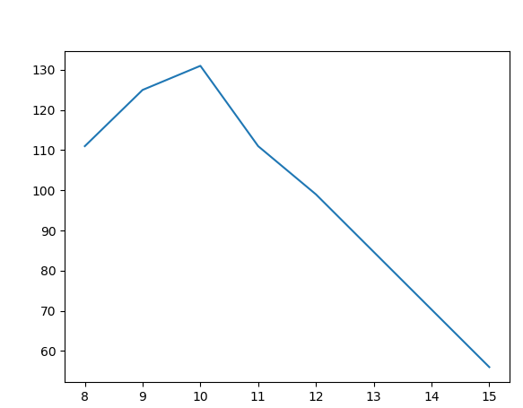

# 一、数据分析介绍

**什么是数据分析：**

`百度百科`：数据分析是指用适当的统计分析方法对收集来的大量数据进行分析，提取有用信息和形成结论而对数据加以详细研究和概括总结的过程。这一过程也是质量管理体系的支持过程。在实用中，数据分析可帮助人们作出判断，以便采取适当行动。

**数据分析的过程：**

1. 数据收集：本地数据或者网络数据的采集与操作.

2. 数据处理：数据的规整，按照某种格式进行整合存储。

3. 数据分析：数据的科学计算，使用相关数据工具进行分析。

4. 数据展现：数据可视化，使用相关工具对分析出的数据进行展示。

**大数据分析场景和模型应用**

数据分析建模需要先明确业务需求，然后选择是 **描述型分析** 还是 **预测型分析**。

- 如果分析的目的是描述目标行为模式，就采用描述型数据分析，描述型分析就考虑 **关联规则**、 **序列规则** 、 **聚类** 等模型。
- 如果是预测型数据分析，就是量化未来一段时间内，某个事件的发生概率。有两大预测分析模型， **分类预测** 和 **回归预测**。


## 1、数据建模分类


### 1、分类与回归

- 分类：是通过已有的训练样本去训练得到一个最优模型，再利用这个模型将输入映射为相应的输出，对输出进行简单的判断从而实现分类的目的，也就具有了对未知数据进行分类的能力。
- 回归：是基于观测数据建立变量间适当的依赖关系，以分析数据内在的规律，得到响应的判断。并可用于预报、控制等问题。

**应用：**

信用卡申请人风险评估、预测公司业务增长量、预测房价，未来的天气情况等

**原理：**

- 回归：用属性的 **历史数据** 预测未来趋势。算法首先假设一些已知类型的函数可以匹配目标数据，然后分析匹配后的误差，确定一个与目标数据匹配程度最好的函数。回归是对真实值的一种 **逼近预测**。
- 分类：将数据映射到 **预先定义的** 群组或类。算法要求基于数据 **特征值** 来定义类别，把具有某些特征的数据项映射到给定的某个类别上。分类并没有逼近的概念，最终正确结果只有一个。 **在机器学习方法里，分类属于监督学习。**

**区别：**

分类模型采用 **离散预测值**，回归模型采用 **连续的预测值**。

### 2、聚类

- 聚类：就是将相似的事物聚集在一起，不相似的事物划分到不同的类别的过程。
- 聚类分析：又称群分析，它是研究（样品或指标）分类问题的一种统计分析方法，同时也是数据挖掘的一个重要算法。

**应用：**

根据症状归纳特定疾病、发现信用卡高级用户、根据上网行为对客户分群从而进行精确营销等。

**原理：**

在没有给定划分类的情况下，根据信息相似度进行信息聚类。

聚类的输入是一组 **未被标记的数据**，根据样本特征的距离或相似度进行划分。划分原则是保持最大的组内相似性和最小的组间相似性。

不同于分类，聚类事先 **没有任何训练样本**，直接对数据进行建模。聚类分析的目标，就是在相似的基础上收集数据来分类。 **在机器学习方法里，聚类属于无监督学习。**

### 3、时序模型

- 不管在哪个领域中（如金融学、经济学、生态学、神经科学、物理学等），时间序列（time series）数据都是一种重要的结构化数据形式。在多个时间点观察或测量到的任何事物，都可以形成一段时间序列。时间序列大多都是固定频率的，数据点将根据某种规律定期出现。

**应用：**

下个季度的商品销量或库存量是多少？明天用电量是多少？今天的北京地铁13号线的人流情况？

**原理：**

描述 **基于时间或其他序列的** 经常发生的规律或趋势，并对其建模。 与回归一样，用已知的数据预测未来的值，但这些数据的区别是 **变量所处时间的不同**。重点考察数据之间在 **时间维度上的关联性**。

## 2、数据分析应用场景：

### 1、市场营销

- 营销响应分析建模(逻辑回归，决策树)
- 净提升度分析建模(关联规则)
- 客户保有分析建模(卡普兰梅尔分析，神经网络)
- 购物蓝分析(关联分析Apriori)
- 自动推荐系统(协同过滤推荐，基于内容推荐，基于人口统计推荐，基于知识推荐，组合推荐，关联规则)
- 客户细分(聚类)
- 流失预测(逻辑回归)

### 2、风险管理

- 客户信用风险评分(SVM，决策树，神经网络)
- 市场风险评分建模(逻辑回归和决策树)
- 运营风险评分建模(SVM)
- 欺诈检测(决策树，聚类，社交网络)


## 3、人工智能方向学习线路：

#### 1、数据分析基础：

**1、数据可视化处理（matplotlib）**

matplotlib: 最流行的Python底层绘图库，主要做数据可视化图表

**2、科学计算工具（numpy）**

Numpy：提供了一个在Python中做科学计算的基础库，重在数值计算，主要用于多维数组（矩阵）处理的库。用来存储和处理大型矩阵，比Python自身的嵌套列表结构要高效的多。本身是由C语言开发，是个很基础的扩展，Python其余的科学计算扩展大部分都是以此为基础。

**3、数据分析工具（pandas）**

Pandas是一个强大的分析结构化数据的工具集，基于NumPy构建，提供了 **高级数据结构** 和 **数据操作工具**，它是使Python成为强大而高效的数据分析环境的重要因素之一。

#### 2、机器学习：

**1、k-近邻算法**

**2、朴素贝叶斯算法**

**3、线性回归**

**4、逻辑回归**

**5、决策树和随机森林**

#### 3、深度学习：

**1、自然语言处理**

**2、简单网络神经**

**3、卷积网络神经**


#二、matplotlib

matplotlib官方文档：https://matplotlib.org/

2、安装matplotlib

```python
pip install matplotlib
```

**使用流程：**

1、明确问题

2、选择图形呈现的方式

3、准备数据

4、绘图和图形完善

## 1、matplotlib折线图


每个红色的点是坐标,把5个点的坐标连接成一条线,组成了一个折线图

```python
x=[0,2,4,6,8]
y=[1,5,3,9,7]
```

**折线图简单的应用场景**

1、呈现公司产品(不同区域)每天活跃用户数
2、呈现app每天下载数量
3、呈现产品新功能上线后,用户点击次数随时间的变化
4、呈现员工每天上下班时间

### 1、绘制折线图

那么到底如何把它通过代码画出来呢?

**入门案列**

现在有两组数据，商品的价格和销量，

```
#价格
price=[8,9,10,11,12,13]
#销量
num =[222,125,131,111,99]
```

我们要以图形的方式展示，从中分析出规律，找出最合适的定价

```python
from matplotlib import pylab 
#价格
price=[8,9,10,11,12,13]
#销量
num =[222,125,131,111,99]
#绘制图形，第一个参数是X轴，第二个参数是Y轴
pylab.plot(x,y) 
#显示图形
pylab.show()

```

运行程序，得到以下图形




### 2、怎么设置图片大小

```python
#设置图片大小figsize=(宽,高)，dpi像素设置(每一英寸上的像素点)
pylab.figure(figsize=(20,10),dpi=50)
```

### 3、怎么保存图片？

```python
#保存图片
pylab.savefig("./1.png")
```

### 4、添加描述信息

比如x轴和y轴表示什么,这个图表示什么

```python
#添加X轴和Y轴的描述信息
pylab.xlabel('时间',fontproperties=font)
pylab.ylabel('温度',fontproperties=font)
#图表的描述信息
pylab.title('10点到12点的每分钟的气温变化',fontproperties=font)
```

### 5、调整x或者y的刻度的间距

```python
#设置X轴的刻度,接收一个列表
pylab.xticks([8,10,12,14,16])
#设置Y轴的刻度
pylab.yticks([40,60,80,100,120,140])
```


### 6、显示中文数据

```python
#查看linux/mac下面支持的字体:
fc-list   #查看支持的字体
fc-list :lang=zh  #查看支持的中文(冒号前面有空格)

# windows的字体数据都在 C:\Windows\Fonts这个路径下面
    
#显示中文
from matplotlib import font_manager
#自定电脑中的字体位置
font=font_manager.FontProperties(fname="C:\Windows\Fonts\simsun.ttc")

#ratation参数设置刻度显示的旋转度数
pylab.xticks(_x,_x_list,rotation=45,fontproperties=font)
```


### 7、绘制网格

```python

#绘制网格
pylab.grid()

#绘制网格的时候更改透明度
pylab.grid(alpha=0.1)


```

### 8、如何绘制多条折线

同一个x绘制两次

```python

y1 =[111,222,213,222,3,2,232]
y2 =[111,222,213,222,3,2,232]

pylab.plot(x,y1) 
pylab.plot(x,y2) 
```

### 9、添加图例信息

上面我们绘制了两条折线图，那么如何区分两张折线图？这个时候就要添加图列信息

```python
#第一步在绘图的时候，通过label参数可以指定表名
pylab.plot(x,y_1,label="图1")
pylab.plot(x,y_2,label="图2")

#第二步、添加图例

#loc参数指定显示位置 prop参数可以指定字体
pylab.legend(prop=my_font,loc="upper left")

```

参数loc设置的时候，设置它可以遵循以下的表格

|    String    | Number |
| :----------: | :----: |
| upper right  |   1    |
|  upper left  |   2    |
|  lower left  |   3    |
| lower right  |   4    |
|    right     |   5    |
| center left  |   6    |
| center right |   7    |
| lower center |   8    |
| upper center |   9    |
|    center    |   10   |

### 10、设置线条的颜色

```python
#在绘制图的时候通过color参数指定颜色
pylab.pylab.plot(x,y_1,label="图1"，color='read')
pylab.plot(x,y_2,label="图2",color="#DB7093",)

颜色之间的对应关系为
b---blue 
c---cyan 
g---green    
k----black
m---magenta
r---red  
w---white   
y----yellow
表示颜色的方式:
第一种 : 用全名  如 cyan
第二种： 16进制  如：#FF00FF 
```

### 11、设置线条的类型

```python
#线条类型，t通过linestyle参数来设置
pyplot.plot(x,y_2,label="图2",color="#DB7093",linestyle="--")
```

|  实线  |  -   |
| :----: | :--: |
|  虚线  |  --  |
|  点线  |  -.  |
| 虚点线 |  :   |

### 12、设置线条粗细

```python
#设置线条粗细可以通过linewidth这个参数来设置

#同样也可以通过alpha参数来设置线条的透明度
pylab.plot(x,y_1,label="图1",color="cyan",linewidth=5,alpha=0.5)

```


标记出特殊的点**(**比如告诉别人最高点和最低点在哪里**)**

给图片添加一个水印(防伪,防止盗用)

## 2、matplotlib绘制散点图

**绘图方法scatter()**

假设现在这里有两组数据：三月份和十月份的气温数据，我们要从中分析出气温变化的规律

```
假设通过爬虫你获取到了北京2016年3,10月份每天白天的最高气温(分别位于列表a,b),那么此时如何寻找出气温和随时间(天)变化的某种规律?

a = [11,17,16,11,12,11,12,6,6,7,8,9,12,15,14,17,18,21,16,17,20,14,15,15,15,19,21,22,22,22,23]
b = [26,26,28,19,21,17,16,19,18,20,20,19,22,23,17,20,21,20,22,15,11,15,5,13,17,10,11,13,12,13,6]
```

代码

```python
from matplotlib import pyplot
from matplotlib import font_manager

my_font=font_manager.FontProperties(fname="C:\Windows\Fonts\simsun.ttc")

y_3 =[11,17,16,11,12,11,12,6,6,7,8,9,12,15,14,17,18,21,16,17,20,14,15,15,15,19,21,22,22,22,23]
y_10 = [26,26,28,19,21,17,16,19,18,20,20,19,22,23,17,20,21,20,22,15,11,15,5,13,17,10,11,13,12,13,6]

x_3 = range(1,32)
x_10 = range(51,82)

#设置图形大小
pyplot.figure(figsize=(20,8),dpi=80)

#使用scatter方法绘制散点图,和之前绘制折线图的唯一区别
pyplot.scatter(x_3,y_3,label="3月份")
pyplot.scatter(x_10,y_10,label="10月份")

#调整x轴的刻度
_x = list(x_3)+list(x_10)
_xtick_labels = ["3月{}日".format(i) for i in x_3]
_xtick_labels += ["10月{}日".format(i-50) for i in x_10]
pyplot.xticks(_x[::3],_xtick_labels[::3],fontproperties=my_font,rotation=45)

#添加图例
pyplot.legend(loc="upper left",prop=my_font)

#添加描述信息
pyplot.xlabel("时间",fontproperties=my_font)
pyplot.ylabel("温度",fontproperties=my_font)
pyplot.title("标题",fontproperties=my_font)
#展示
pyplot.show()
```


## 3、matplotlib绘制条形图


### 1、竖型 条形图

**方法：bar()**

```python
from matplotlib import pyplot
from matplotlib import font_manager

my_font=font_manager.FontProperties(fname="C:\Windows\Fonts\simsun.ttc")


a = ["战狼2","速度与激情8","功夫瑜伽","西游伏妖篇","变形金刚5：最后的骑士","摔跤吧！爸爸","加勒比海盗5：死无对证","金刚：骷髅岛","极限特工：终极回归","生化危机6：终章","乘风破浪","神偷奶爸3","智取威虎山","大闹天竺","金刚狼3：殊死一战","蜘蛛侠：英雄归来","悟空传","银河护卫队2","情圣","新木乃伊",]

b=[56.01,26.94,17.53,16.49,15.45,12.96,11.8,11.61,11.28,11.12,10.49,10.3,8.75,7.55,7.32,6.99,6.88,6.86,6.58,6.23]


#设置图形大小
pyplot.figure(figsize=(20,15),dpi=80)


#绘制条形图  width设置：
pyplot.bar(range(len(a)),b,width=0.3)

#设置字符串到x轴
pyplot.xticks(range(len(a)),a,fontproperties=my_font,rotation=90)

pyplot.savefig("./movie.png")

pyplot.show()

```

### 2、横型 条形图

**方法：barh()**

```python
from matplotlib import pyplot 
from matplotlib import font_manager

my_font=font_manager.FontProperties(fname="C:\Windows\Fonts\simsun.ttc")


a = ["战狼2","速度与激情8","功夫瑜伽","西游伏妖篇","变形金刚5：最后的骑士","摔跤吧！爸爸","加勒比海盗5：死无对证","金刚：骷髅岛","极限特工：终极回归","生化危机6：终章","乘风破浪","神偷奶爸3","智取威虎山","大闹天竺","金刚狼3：殊死一战","蜘蛛侠：英雄归来","悟空传","银河护卫队2","情圣","新木乃伊",]

b=[56.01,26.94,17.53,16.49,15.45,12.96,11.8,11.61,11.28,11.12,10.49,10.3,8.75,7.55,7.32,6.99,6.88,6.86,6.58,6.23]


#设置图形大小
pyplot.figure(figsize=(20,15),dpi=80)


#绘制条形图  width设置：
pyplot.barh(range(len(b)),b,height=0.3)

pyplot.grid()
#设置字符串到x轴
pyplot.yticks(range(len(b)),a,fontproperties=my_font)

pyplot.savefig("./movie.png")

pyplot.show()
```

### 3、绘制多组条形图


```python
假设你知道了列表a中电影分别在2017-09-14(b_14), 2017-09-15(b_15), 2017-09-16(b_16)三天的票房,为了展示列表中电影本身的票房以及同其他电影的数据对比情况,应该如何更加直观的呈现该数据?

a = ["猩球崛起3：终极之战","敦刻尔克","蜘蛛侠：英雄归来","战狼2"]
b_16 = [15746,312,4497,319]
b_15 = [12357,156,2045,168]
b_14 = [2358,399,2358,362]

数据来源: http://www.cbooo.cn/movieday

```


```python
from matplotlib import pyplot 
from matplotlib import font_manager
my_font = font_manager.FontProperties(fname="C:\Windows\Fonts\simsun.ttc")


a = ["猩球崛起3：终极之战","敦刻尔克","蜘蛛侠：英雄归来","战狼2"]
b_16 = [15746,312,4497,319]
b_15 = [12357,156,2045,168]
b_14 = [2358,399,2358,362]

bar_width = 0.2

x_14 = list(range(len(a)))
x_15 =  [i+bar_width for i in x_14]
x_16 = [i+bar_width*2 for i in x_14]

#设置图形大小
pyplot.figure(figsize=(20,8),dpi=80)

pyplot.bar(range(len(a)),b_14,width=bar_width,label="9月14日")
pyplot.bar(x_15,b_15,width=bar_width,label="9月15日")
pyplot.bar(x_16,b_16,width=bar_width,label="9月16日")

#设置图例
pyplot.legend(prop=my_font)

#设置x轴的刻度
pyplot.xticks(x_15,a,fontproperties=my_font)

pyplot.show()
```


## 4、matplotlib绘制直方图

**应用场景**

数量统计
频率统计(市场饱和度)

```
假设你获取了250部电影的时长(列表a中),希望统计出这些电影时长的分布状态(比如时长为100分钟到120分钟电影的数量,出现的频率)等信息,你应该如何呈现这些数据?

a=[131,  98, 125, 131, 124, 139, 131, 117, 128, 108, 135, 138, 131, 102, 107, 114, 119, 128, 121, 142, 127, 130, 124, 101, 110, 116, 117, 110, 128, 128, 115,  99, 136, 126, 134,  95, 138, 117, 111,78, 132, 124, 113, 150, 110, 117,  86,  95, 144, 105, 126, 130,126, 130, 126, 116, 123, 106, 112, 138, 123,  86, 101,  99, 136,123, 117, 119, 105, 137, 123, 128, 125, 104, 109, 134, 125, 127,105, 120, 107, 129, 116, 108, 132, 103, 136, 118, 102, 120, 114,105, 115, 132, 145, 119, 121, 112, 139, 125, 138, 109, 132, 134,156, 106, 117, 127, 144, 139, 139, 119, 140,  83, 110, 102,123,107, 143, 115, 136, 118, 139, 123, 112, 118, 125, 109, 119, 133,112, 114, 122, 109, 106, 123, 116, 131, 127, 115, 118, 112, 135,115, 146, 137, 116, 103, 144,  83, 123, 111, 110, 111, 100, 154,136, 100, 118, 119, 133, 134, 106, 129, 126, 110, 111, 109, 141,120, 117, 106, 149, 122, 122, 110, 118, 127, 121, 114, 125, 126,114, 140, 103, 130, 141, 117, 106, 114, 121, 114, 133, 137,  92,121, 112, 146,  97, 137, 105,  98, 117, 112,  81,  97, 139, 113,134, 106, 144, 110, 137, 137, 111, 104, 117, 100, 111, 101, 110,105, 129, 137, 112, 120, 113, 133, 112,  83,  94, 146, 133, 101,131, 116, 111,  84, 137, 115, 122, 106, 144, 109, 123, 116, 111,111, 133, 150]


```


**应用场景**

用户的年龄分布状态
一段时间内用户点击次数的分布状态
用户活跃时间的分布状态


### 1、数据分组

组距：每个组之间的距离

```
（例：100分为10组，那么组距为10）
```

组数：所有的数据分为多少组

```
组数=（最大值-最小值）/组距
```

### 2、案列

```python
from matplotlib import pyplot
from matplotlib import font_manager

a=[131,  98, 125, 131, 124, 139, 131, 117, 128, 108, 135, 138, 131, 102, 107, 114, 119, 128, 121, 142, 127, 130, 124, 101, 110, 116, 117, 110, 128, 128, 115,  99, 136, 126, 134,  95, 138, 117, 111,78, 132, 124, 113, 150, 110, 117,  86,  95, 144, 105, 126, 130,126, 130, 126, 116, 123, 106, 112, 138, 123,  86, 101,  99, 136,123, 117, 119, 105, 137, 123, 128, 125, 104, 109, 134, 125, 127,105, 120, 107, 129, 116, 108, 132, 103, 136, 118, 102, 120, 114,105, 115, 132, 145, 119, 121, 112, 139, 125, 138, 109, 132, 134,156, 106, 117, 127, 144, 139, 139, 119, 140,  83, 110, 102,123,107, 143, 115, 136, 118, 139, 123, 112, 118, 125, 109, 119, 133,112, 114, 122, 109, 106, 123, 116, 131, 127, 115, 118, 112, 135,115, 146, 137, 116, 103, 144,  83, 123, 111, 110, 111, 100, 154,136, 100, 118, 119, 133, 134, 106, 129, 126, 110, 111, 109, 141,120, 117, 106, 149, 122, 122, 110, 118, 127, 121, 114, 125, 126,114, 140, 103, 130, 141, 117, 106, 114, 121, 114, 133, 137,  92,121, 112, 146,  97, 137, 105,  98, 117, 112,  81,  97, 139, 113,134, 106, 144, 110, 137, 137, 111, 104, 117, 100, 111, 101, 110,105, 129, 137, 112, 120, 113, 133, 112,  83,  94, 146, 133, 101,131, 116, 111,  84, 137, 115, 122, 106, 144, 109, 123, 116, 111,111, 133, 150]

#计算组数
d = 3  #组距
num_bins = (max(a)-min(a))//d
print(max(a),min(a),max(a)-min(a))
print(num_bins)


#设置图形的大小
pyplot.figure(figsize=(20,8),dpi=80)

#频次分布直方图
pyplot.hist(a,num_bins)
#频率分布直方图
#pyplot.hist(a,num_bins,normed=True)

#设置x轴的刻度
pyplot.xticks(range(min(a),max(a)+d,d))

pyplot.grid()

pyplot.show()


```

饼图

```python
import matplotlib.pyplot as plt

# 饼图，将按逆时针顺序排列和排列：
labels = 'Frogs', 'Hogs', 'Dogs', 'Logs'
sizes = [15, 30, 45, 10]
# 设置爆炸
explode = (0.1, 0, 0, 0)  # only "explode" the 2nd slice (i.e. 'Hogs')

fig1, ax1 = plt.subplots()
# sizes数据
# explode爆炸效果
# labels表名
# autopct百分比显示格式
# startangle旋转度数，
# shadow参数  加入立体背影
ax1.pie(sizes, explode=explode, labels=labels, autopct='%1.1f%%',
         startangle=90,shadow=True,)
# 相等的纵横比确保馅饼被画成圆。
ax1.axis('equal') 
plt.show()
```


## 5、其他可视化的画图工具

其他的python可视化模块：

### 1、plot

**官网：https://plot.ly/python/**

### 2、seaborn

**官网：http://seaborn.pydata.org/index.html**

### 3、bokeh

**官网: https://bokeh.pydata.org/en/latest/**

前端可视化框架

### 4、echarts

**官网**:**http://echarts.baidu.com/**


