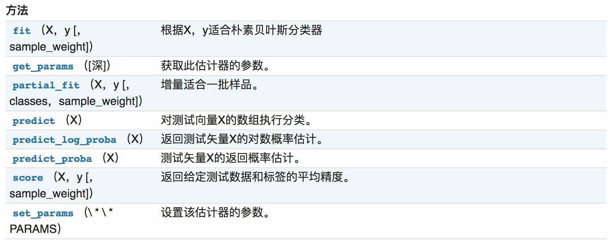

# 一、朴素贝叶斯

朴素贝叶斯（Naive Bayes）是一个非常简单，但是实用性很强的分类模型。朴素贝叶斯分类器的构造基础是贝叶斯理论。

##


## 1、概率论基础

概率定义为一件事情发生的可能性。事情发生的概率可以 通过观测数据中的事件发生次数来计算，事件发生的概率等于改事件发生次数除以所有事件发生的总次数。举一些例子：

- 扔出一个硬币，结果头像朝上
- 某天是晴天
- 某个单词在未知文档中出现

我们将事件的概率记作P\left({X}\right)P(X)，那么假设这一事件为X属于样本空间中的一个类别，那么{0}\le{P}\left({X}\right)\le{1}0≤P(X)≤1。

**联合概率与条件概率**

- **联合概率**

是指两件事情同时发生的概率。那么我们假设样本空间有一些天气数据：

| 编号 | 星期几 | 天气 |
| ---- | ------ | ---- |
| 1    | 2      | 晴天 |
| 2    | 1      | 下雨 |
| 3    | 3      | 晴天 |
| 4    | 4      | 晴天 |
| 5    | 1      | 下雨 |
| 6    | 2      | 下雪 |
| 7    | 3      | 下雪 |

那么天气被分成了三类，那么P\left(X=sun\right){=}\frac{3}{7}P(X=sun)=73，假如说天气=下雪且星期几=2？这个概率怎么求？这个概率应该等于两件事情为真的次数除以所有事件发生 的总次数。我们可以看到只有一个样本满足天气=下雪且星期几=2，所以这个概率为\frac{1}{7}71。一般对于X和Y来说，对应的联合概率记为P\left({XY}\right)P(XY)。

- **条件概率**

那么条件概率形如P\left({X}\mid{Y}\right)P(X∣Y)，这种格式的。表示为在Y发生的条件下，发生X的概率。假设X代表星期，Y代表天气，则 P\left({X=3}\mid{Y=sun}\right)P(X=3∣Y=sun)如何求？

从表中我们可以得出，P\left({X=3,Y=sun}\right){=}\frac{1}{7}P(X=3,Y=sun)=71,P\left({Y}\right){=}\frac{3}{7}P(Y)=73

P\left({X=3}\mid{Y=sun}\right){=}\frac{1}{3}{=}\frac{P\left({X=3,Y=sun}\right)}{P\left({Y}\right)}P(X=3∣Y=sun)=31=P(Y)P(X=3,Y=sun)

在条件概率中，有一个重要的特性

- **如果每个事件之间相互独立**

那么则有P\left({X_1,X_2,X_3,...,X_n}\mid{Y_i}\right){=}{P}\left({X_1}\mid{Y_i}\right) {P}\left({X_2}\mid{Y_i}\right) {P}\left({X_3}\mid{Y_i}\right){...}{P}\left({X_n}\mid{Y_i}\right)P(X1,X2,X3,...,Xn∣Yi)=P(X1∣Yi)P(X2∣Yi)P(X3∣Yi)...P(Xn∣Yi)

这个式子的意思是给定条件下，所有的X的概率为单独的Y条件下每个X发生的概率乘积，我们通过后面再继续去理解这个式子的具体含义。

**贝叶斯公式**

首先我们给出该公式的表示

贝叶斯公式最常用于文本分类，上式左边可以理解为给定一个文本词向量WW，那么它属于类别c_ici的概率是多少。那么式子右边分几部分，P\left({W}\mid{c_i}\right)P(W∣ci)理解为在给定类别的情况下，该文档的词向量的概率。可以通过条件概率中的重要特性来求解。

假设我们有已分类的文档，

```
a = "life is short,i like python"
b = "life is too long,i dislike python"
c = "yes,i like python"
label=[1,0,1]
```

**词袋法的特征值计算**

若使用词袋法，且以训练集中的文本为词汇表，即将训练集中的文本中出现的单词(不重复)都统计出来作为词典，那么记单词的数目为n，这代表了文本的n个维度。以上三个文本在这8个特征维度上的表示为：

|      | life | is   | i    | short | long | like | dislike | too  | python | yes  |
| ---- | ---- | ---- | ---- | ----- | ---- | ---- | ------- | ---- | ------ | ---- |
| a'   | 1    | 1    | 1    | 1     | 0    | 1    | 0       | 0    | 1      | 0    |
| b'   | 1    | 1    | 1    | 0     | 1    | 0    | 1       | 1    | 1      | 0    |
| c'   | 0    | 0    | 1    | 0     | 0    | 1    | 0       | 0    | 1      | 1    |

上面a',b'就是两个文档的词向量的表现形式，对于贝叶斯公式，从label中我们可以得出两个类别的概率为：

P\left({c_i=1}\right){=}0.5,P\left({c_i=0}\right){=}0.5P(ci=1)=0.5,P(ci=0)=0.5

对于一个给定的文档类别，每个单词特征向量的概率是多少呢？

**提供一种TF计算方法**，为类别y_kyk每个单词出现的次数N_iNi,除以文档类别y_kyk中所有单词出现次数的总数NN：

P_i{=}\frac{N_i}{N}Pi=NNi

首先求出现总数，对于1类别文档，在a'中，就可得出总数为1+1+1+1+1+1=6，c'中，总共1+1+1+1=4，故在1类别文档中总共有10次

每个单词出现总数，假设是两个列表，a'+c'就能得出每个单词出现次数，比如P\left({w=python}\right){=}\frac{2}{10}{=}{0.20000000}P(w=python)=102=0.20000000,同样可以得到其它的单词概率。最终结果如下：

```
# 类别1文档中的词向量概率
p1 = [0.10000000,0.10000000,0.20000000,0.10000000,0,0.20000000,0,0,0.20000000,0.10000000]
# 类别0文档中的词向量概率
p0 = [0.16666667,0.16666667,0.16666667,0,0.16666667,0,0.16666667,0.16666667,0.16666667,0]
```

**拉普拉斯平滑系数**

为了避免训练集样本对一些特征的缺失，即某一些特征出现的次数为0，在计算P\left({X_1,X_2,X_3,...,X_n}\mid{Y_i}\right)P(X1,X2,X3,...,Xn∣Yi)的时候，各个概率相乘最终结果为零，这样就会影响结果。我们需要对这个概率计算公式做一个平滑处理:

P_i{=}\frac{N_i+\alpha}{N+\alpha*m}Pi=N+α∗mNi+α

其中mm为特征词向量的个数，\alphaα为平滑系数，当\alpha{=}1α=1，称为拉普拉斯平滑

## 2、MultinomialNB

```python
class sklearn.naive_bayes.MultinomialNB(alpha=1.0, fit_prior=True, class_prior=None)
  """
  :param alpha：float，optional（default = 1.0）加法（拉普拉斯/ Lidstone）平滑参数（0为无平滑）
  """
```



## 3、互联网新闻分类

**读取20类新闻文本的数据细节**

```python
from sklearn.datasets import fetch_20newsgroups

news = fetch_20newsgroups(subset='all')

print news.data[0]
```

上述代码得出该数据共有18846条新闻，但是这些文本数据既没有被设定特征，也没有数字化的亮度。因此，在交给朴素贝叶斯分类器学习之前，要对数据做进一步的处理。

**20类新闻文本数据分割**

```python
from sklearn.cross_validation import train_test_split

X_train,X_test,y_train,y_test = train_test_split(news.data,news.target,test_size=0.25,random_state=42)
```

**文本转换为特征向量进行TF特征抽取**

```python
from sklearn.feature_extraction.text import CountVectorizer

vec = CountVectorizer()
# 训练数据输入，并转换为特征向量
X_train = vec.fit_transform(X_train)
# 测试数据转换
X_test = vec.transform(X_test)
```

**朴素贝叶斯分类器对文本数据进行类别预测**

```python
from sklearn.naive_bayes import MultinomialNB

# 使用平滑处理初始化的朴素贝叶斯模型
mnb = MultinomialNB(alpha=1.0)

# 利用训练数据对模型参数进行估计
mnb.fit(X_train,y_train)

# 对测试验本进行类别预测。结果存储在变量y_predict中
y_predict = mnb.predict(X_test)
```

**性能测试**

- 特点分析

朴素贝叶斯模型被广泛应用于海量互联网文本分类任务。由于其较强的特征条件独立假设，使得模型预测所需要估计的参数规模从幂指数量级想线性量级减少，极大的节约了内存消耗和计算时间。到那时，也正是受这种强假设的限制，模型训练时无法将各个特征之间的联系考量在内，使得该模型在其他数据特征关联性较强的分类任务上的性能表现不佳

```python
from sklearn.datasets import fetch_20newsgroups
from sklearn.feature_extraction.text import CountVectorizer
import numpy as np
from sklearn.neighbors import KNeighborsClassifier
from sklearn.model_selection import GridSearchCV, train_test_split
from sklearn.naive_bayes import MultinomialNB


class Model_SK(object):
    '''K近邻和贝叶斯的比较'''

    def __init__(self):
        '''
        读取数据，特征化处理
        '''

        # 读取数据
        li = fetch_20newsgroups(subset='all')
        # 进行分割
        self.X_data, self.Y_data, self.X_tar, self.Y_tar = train_test_split(li.data, li.target, test_size=0.2)
        # 进行特征化抽取
        cv = CountVectorizer()
        # 训练数据特征化处理
        self.X_data = cv.fit_transform(self.X_data)
        # 测试数据特征化处理
        self.Y_data = cv.transform(self.Y_data)

    def k_func(self):
        '''
        K近邻算法
        :return:
        '''
        # 创建K近邻模型实例
        knn = KNeighborsClassifier(n_neighbors=10)
        # 训练模型
        knn.fit(self.X_data, self.X_tar)

        # 获取模型识别的精确率
        kk = knn.score(self.Y_data, self.Y_tar)

        print('k近邻的识别成功率:', kk)

    def mnb_func(self):
        '''
        朴素贝叶斯算法
        :return:
        '''
        # 创建贝叶斯模型实例
        mnb = MultinomialNB()

        # 训练数据
        mnb.fit(self.X_data, self.X_tar)

        # 获取模型识别的精确率
        kk = mnb.score(self.Y_data, self.Y_tar)

        print('朴素贝叶斯的识别成功率', kk)


if __name__ == '__main__':
    md1 = Model_SK()

    md1.k_func()

    md1.mnb_func()
```


# 二、分类决策树

决策树是一种基本的分类方法，当然也可以用于回归。我们一般只讨论用于分类的决策树。决策树模型呈树形结构。在分类问题中，表示基于特征对实例进行分类的过程，它可以认为是if-then规则的集合。在决策树的结构中，每一个实例都被一条路径或者一条规则所覆盖。通常决策树学习包括三个步骤：**特征选择**、决策树的生成和决策树的修剪

> 优点：计算复杂度不高，输出结果易于理解，对中间值的缺失不敏感，**可以处理逻辑回归等不能解决的非线性特征数据**
>
> 缺点：可能产生过度匹配问题
>
> 适用数据类型：数值型和标称型

## 1、特征选择

特征选择在于选取对训练数据具有分类能力的特征。这样可以提高决策树学习的效率，如果利用一个特征进行分类的结果与随机分类的结果没有很大差别，则称这个特征是没有分类能力的。经验上扔掉这样的特征对决策树学习的京都影响不大。通常特征选择的准则是信息增益，这是个数学概念。通过一个例子来了解特征选择的过程。

| ID   | 年龄 | 有工作 | 有自己的房子 | 信贷情况 | 类别 |
| ---- | ---- | ------ | ------------ | -------- | ---- |
| 1    | 青年 | 否     | 否           | 一般     | 否   |
| 2    | 青年 | 否     | 否           | 好       | 否   |
| 3    | 青年 | 是     | 否           | 好       | 是   |
| 4    | 青年 | 是     | 是           | 一般     | 是   |
| 5    | 青年 | 否     | 否           | 一般     | 否   |
| 6    | 中年 | 否     | 否           | 一般     | 否   |
| 7    | 中年 | 否     | 否           | 好       | 否   |
| 8    | 中年 | 是     | 是           | 好       | 是   |
| 9    | 中年 | 否     | 是           | 非常好   | 是   |
| 10   | 中年 | 否     | 是           | 非常好   | 是   |
| 11   | 老年 | 否     | 是           | 非常好   | 是   |
| 12   | 老年 | 否     | 是           | 好       | 是   |
| 13   | 老年 | 是     | 否           | 好       | 是   |
| 14   | 老年 | 是     | 否           | 非常好   | 是   |
| 15   | 老年 | 否     | 否           | 一般     | 否   |

我们希望通过所给的训练数据学习一个贷款申请的决策树，用以对文莱的贷款申请进行分类，即当新的客户提出贷款申请是，根据申请人的特征利用决策树决定是否批准贷款申请。特征选择其实是决定用那个特征来划分特征空间。下图中分别是按照年龄，还有是否有工作来划分得到不同的子节点


问题是究竟选择哪个特征更好些呢？那么直观上，如果一个特征具有更好的分类能力，是的各个自己在当前的条件下有最好的分类，那么就更应该选择这个特征。信息增益就能很好的表示这一直观的准则。这样得到的一棵决策树只用了两个特征就进行了判断：

通过信息增益生成的决策树结构，更加明显、快速的划分类别。下面介绍scikit-learn中API的使用

## 2、信息的度量和作用

我们常说信息有用，那么它的作用如何客观、定量地体现出来呢？信息用途的背后是否有理论基础呢？这个问题一直没有很好的回答，直到1948年，香农在他的论文“通信的数学原理”中提到了“信息熵”的概念，才解决了信息的度量问题，并量化出信息的作用。

一条信息的信息量与其不确定性有着直接的关系，比如我们要搞清一件非常不确定的事，就需要大量的信息。相反如果对某件事了解较多，则不需要太多的信息就能把它搞清楚 。所以从这个角度看，可以认为，信息量就等于不确定的多少。那么如何量化信息量的度量呢？2022年举行世界杯，大家很关系谁是冠军。假如我错过了看比赛，赛后我问朋友 ，“谁是冠军”？他不愿意直接告诉我，让我每猜一次给他一块钱，他告诉我是否猜对了，那么我需要掏多少钱才能知道谁是冠军？我可以把球编上号，从1到32，然后提问：冠 军在1-16号吗？依次询问，只需要五次，就可以知道结果。所以谁是世界杯冠军这条消息只值五块钱。当然香农不是用钱，而是用“比特”这个概念来度量信息量。一个比特是 一位二进制数，在计算机中一个字节是8比特。

那么如果说有一天有64支球队进行决赛阶段的比赛，那么“谁是世界杯冠军”的信息量就是6比特，因为要多猜一次，有的同学就会发现，信息量的比特数和所有可能情况的对数函数log有关，(log32=5,log64=6)

另外一方面你也会发现实际上我们不需要猜五次就能才出冠军，因为像西班牙、巴西、德国、意大利这样的球队夺得冠军的可能性比南非、尼日利亚等球队大得多，因此第一次猜测时不需要把32支球队等分成两个组，而可以把少数几支最有可能的球队分成一组，把其他球队分成一组。然后才冠军球队是否在那几支热门队中。这样，也许三次就猜出结果。因此，当每支球队夺冠的可能性不等时，“谁是世界杯冠军”的信息量比5比特少。香农指出，它的准确信息量应该是：

H = -(p1*logp1 + p2*logp2 + ... + p32log32)

其中，p1...p32为这三支球队夺冠的概率。**H的专业术语称之为信息熵，单位为比特**，当这32支球队夺冠的几率相同时，对应的信息熵等于5比特，这个可以通过计算得出。有一个特性就是，5比特是公式的最大值。那么信息熵（经验熵）的具体定义可以为如下：

H\left(X\right){=}\sum_{x\in{X}}P\left(x\right)logP\left(x\right)H(X)=∑x∈XP(x)logP(x)

## 3、信息增益

自古以来，信息和消除不确定性是相联系的。所以决策树的过程其实是在寻找某一个特征对整个分类结果的不确定减少的过程。那么这样就有一个概念叫做信息增益（information gain）。

**那么信息增益表示得知特征X的信息而是的类Y的信息的不确定性减少的程度**，所以我们对于选择特征进行分类的时候，当然选择信息增益较大的特征，这样具有较强的分类能力。特征A对训练数据集D的信息增益g(D,A),定义为集合D的经验熵H(D)与特征A给定条件下D的经验条件熵H(D|A)之差，即公式为：

g\left({D,A}\right){=}H\left(D\right) {-} H\left(D|A\right)g(D,A)=H(D)−H(D∣A)

**根据信息增益的准则的特征选择方法是：对于训练数据集D，计算其每个特征的信息增益，并比较它们的阿笑，选择信息增益最大的特征**

**信息增益的计算**

假设训练数据集为D，|D|表示样本个数。设有K个类C_kCk,k=1,2,3,4...k,|C_k|∣Ck∣为属于类C_kCk的样本个数，\sum_{k=1}^{K}{=}{|D|}∑k=1K=∣D∣.设特征A有n个不同的取值{a1,a2,...,an},根据特征A的取值将D划分为n个子集D1，D2，...，Dn，|Di|∣Di∣为样本个数，其中Di中属于Ck类的样本的集合为D_ikDik

所以首先对于经验熵来说，计算如下：


那么条件熵计算如下：


既然我们有了这两个公式，我们可以根据前面的是否通过贷款申请的例子来通过计算得出我们的决策特征顺序。那么我们首先计算总的经验熵为：


然后我们让A_1,A_2,A_3,A_4A1,A2,A3,A4分别表示年龄、有工作、有自己的房子和信贷情况4个特征，则计算出年龄的信息增益为：


同理其他的也可以计算出来，g(D,A2)=0.324,g(D,A3)=0.420,g(D,A4)=0.363，相比较来说其中特征A3（有自己的房子）的信息增益最大，所以我们选择特征A3为最有特征

## 4、DecisionTreeClassifier

sklearn.tree.DecisionTreeClassifier是一个能对数据集进行多分类的类

```python
class sklearn.tree.DecisionTreeClassifier(criterion='gini', splitter='best', max_depth=None, min_samples_split=2, min_samples_leaf=1, min_weight_fraction_leaf=0.0, max_features=None, random_state=None, max_leaf_nodes=None, min_impurity_split=1e-07, class_weight=None, presort=False)
  """
  :param max_depth：int或None，可选（默认=无）树的最大深度。如果没有，那么节点将被扩展，直到所有的叶子都是纯类，或者直到所有的叶子都包含少于min_samples_split样本

  :param random_state：random_state是随机数生成器使用的种子
  """
```

首先我们导入类，以及数据集，还有将数据分成训练数据集和测试数据集两部分

```python
from sklearn.model_selection import train_test_split
from sklearn.datasets import load_iris
from sklearn.tree import DecisionTreeClassifier
iris = load_iris()
X = iris.data
y = iris.target
X_train, X_test, y_train, y_test = train_test_split(X, y, random_state=0)
estimator = DecisionTreeClassifier(max_leaf_nodes=3, random_state=0)
estimator.fit(X_train, y_train)
```

**method**

**apply** 返回每个样本被预测的叶子的索引

```python
estimator.apply(X)

array([ 1,  1,  1,  1,  1,  1,  1,  1,  1,  1,  1,  1,  1,  1,  1,  1,  1,
        1,  1,  1,  1,  1,  1,  1,  1,  1,  1,  1,  1,  1,  1,  1,  1,  1,
        1,  1,  1,  1,  1,  1,  1,  1,  1,  1,  1,  1,  1,  1,  1,  1,  5,
        5,  5,  5,  5,  5,  5,  5,  5,  5,  5,  5,  5,  5,  5,  5,  5,  5,
        5,  5, 15,  5,  5,  5,  5,  5,  5, 10,  5,  5,  5,  5,  5, 10,  5,
        5,  5,  5,  5,  5,  5,  5,  5,  5,  5,  5,  5,  5,  5,  5, 16, 16,
       16, 16, 16, 16,  6, 16, 16, 16, 16, 16, 16, 16, 16, 16, 16, 16, 16,
        8, 16, 16, 16, 16, 16, 16, 14, 16, 16, 11, 16, 16, 16,  8,  8, 16,
       16, 16, 14, 16, 16, 16, 16, 16, 16, 16, 16, 16, 16, 16])
```

**decision_path** 返回树中的决策路径

```python
dp = estimator.decision_path(X_test)
```

**fit_transform(X,y=None，**fit_params)** 输入数据，然后转换

**predict(X)** 预测输入数据的类型,完整代码

```python
estimator.predict(X_test)
array([2, 1, 0, 2, 0, 2, 0, 1, 1, 1, 2, 1, 1, 1, 1, 0, 1, 1, 0, 0, 1, 1, 0,
       0, 1, 0, 0, 1, 1, 0, 2, 1, 0, 1, 2, 1, 0, 2])

print y_test

array([2, 1, 0, 2, 0, 2, 0, 1, 1, 1, 2, 1, 1, 1, 1, 0, 1, 1, 0, 0, 2, 1, 0,
       0, 2, 0, 0, 1, 1, 0, 2, 1, 0, 2, 2, 1, 0, 1])
```

**score(X,y,sample_weight=None)** 返回给定测试数据的准确精度

```python
estimator.score(X_test,y_test)

0.89473684210526316
```

## 5、决策树本地保存

**sklearn.tree.export_graphviz()** 该函数能够导出DOT格式

```python
from sklearn.datasets import load_iris
from sklearn import tree
clf = tree.DecisionTreeClassifier()
iris = load_iris()
clf = clf.fit(iris.data, iris.target)
tree.export_graphviz(clf,out_file='tree.dot')
```

那么有了tree.dot文件之后，我们可以通过命令转换为png或者pdf格式，首先得安装graphviz

```
ubuntu:sudo apt-get install graphviz
Mac:brew install graphviz
```

然后我们运行这个命令

```
$ dot -Tps tree.dot -o tree.ps
$ dot -Tpng tree.dot -o tree.png
```

或者，如果我们安装了Python模块pydotplus，我们可以直接在Python中生成PDF文件，通过pip install pydotplus，然后运行

```python
import pydotplus
dot_data = tree.export_graphviz(clf, out_file=None)
graph = pydotplus.graph_from_dot_data(dot_data)
graph.write_pdf("iris.pdf")
```


> 扩展：所有各种决策树算法是什么，它们之间有什么不同？哪一个在scikit-learn中实现？
>
> ID3 --- 信息增益 最大的准则
>
> C4.5 --- 信息增益比 最大的准则
>
> CART 回归树: 平方误差 最小 分类树: 基尼系数 最小的准则 在sklearn中可以选择划分的原则

**决策树优缺点分析**

决策树的一些优点是：

- 简单的理解和解释。树木可视化。
- 需要很少的数据准备。其他技术通常需要数据归一化，需要创建虚拟变量，并删除空值。但请注意，此模块不支持缺少值。
- 使用树的成本（即，预测数据）在用于训练树的数据点的数量上是对数的。

决策树的缺点包括：

- 决策树学习者可以创建不能很好地推广数据的过于复杂的树。这被称为过拟合。修剪（目前不支持）的机制，设置叶节点所需的最小采样数或设置树的最大深度是避免此问题的必要条件。
- 决策树可能不稳定，因为数据的小变化可能会导致完全不同的树被生成。通过使用合奏中的决策树来减轻这个问题。

# 三、集成方法（分类）之随机森林

在机器学习中，随机森林是一个包含多个决策树的分类器，并且其输出的类别是由个别树输出的类别的众数而定。利用相同的训练数搭建多个独立的分类模型，然后通过投票的方式，以少数服从多数的原则作出最终的分类决策。例如, 如果你训练了5个树, 其中有4个树的结果是True, 1个数的结果是False, 那么最终结果会是True.

在前面的决策当中我们提到，一个标准的决策树会根据每维特征对预测结果的影响程度进行排序，进而决定不同的特征从上至下构建分裂节点的顺序，如此以来，所有在随机森林中的决策树都会受这一策略影响而构建的完全一致，从而丧失的多样性。所以在随机森林分类器的构建过程中，每一棵决策树都会放弃这一固定的排序算法，转而随机选取特征。

**学习算法**

根据下列算法而建造每棵树：

- 用N来表示训练用例（样本）的个数，M表示特征数目。
- 输入特征数目m，用于确定决策树上一个节点的决策结果；其中m应远小于M。
- 从N个训练用例（样本）中以有放回抽样的方式，取样N次，形成一个训练集（即bootstrap取样），并用未抽到的用例（样本）作预测，评估其误差。
- 对于每一个节点，随机选择m个特征，决策树上每个节点的决定都是基于这些特征确定的。根据这m个特征，计算其最佳的分裂方式。

### 1、RandomForestClassifier

sklearn.ensemble提供了准确性更加好的集成方法，里面包含了主要的RandomForestClassifier(随机森林)方法。

```python
class sklearn.ensemble.RandomForestClassifier(n_estimators=10, criterion=’gini’, max_depth=None, bootstrap=True, oob_score=False, n_jobs=1, random_state=None)
  """
  :param n_estimators：integer，optional（default = 10） 森林里的树木数量。

  :param criteria：string，可选（default =“gini”）分割特征的测量方法

  :param max_depth：integer或None，可选（默认=无）树的最大深度

  :param bootstrap：boolean，optional（default = True）是否在构建树时使用自举样本。

  """
```

### 2、属性

- classes_：shape = [n_classes]的数组或这样的数组的列表，类标签（单输出问题）或类标签数组列表（多输出问题）。

- feature*importances*：array = [n_features]的数组， 特征重要性（越高，功能越重要）。

### 3、方法

- fit（X，y [，sample_weight]） 从训练集（X，Y）构建一棵树林。
- predict（X） 预测X的类
- score（X，y [，sample_weight]） 返回给定测试数据和标签的平均精度。
- decision_path（X） 返回森林中的决策路径

## 案例

泰坦尼克号乘客数据

这里我们通过决策树和随机森林对这个数据进行一个分类，判断乘客的生还。

```python
import pandas as pd
import sklearn
from sklearn.model_selection import train_test_split
from sklearn.feature_extraction import DictVectorizer
from sklearn.tree import DecisionTreeClassifier
from sklearn.metrics import classification_report
from sklearn.ensemble import RandomForestClassifier, GradientBoostingClassifier


titanic = pd.read_csv('http://biostat.mc.vanderbilt.edu/wiki/pub/Main/DataSets/titanic.txt')

#选取一些特征作为我们划分的依据
x = titanic[['pclass', 'age', 'sex']]
y = titanic['survived']

# 填充缺失值
x['age'].fillna(x['age'].mean(), inplace=True)

x_train, x_test, y_train, y_test = train_test_split(x, y, test_size=0.25)

dt = DictVectorizer(sparse=False)

print(x_train.to_dict(orient="record"))

# 按行，样本名字为键，列名也为键，[{"1":1,"2":2,"3":3}]
x_train = dt.fit_transform(x_train.to_dict(orient="record"))

x_test = dt.fit_transform(x_test.to_dict(orient="record"))

# 使用决策树
dtc = DecisionTreeClassifier()

dtc.fit(x_train, y_train)

dt_predict = dtc.predict(x_test)

print(dtc.score(x_test, y_test))

print(classification_report(y_test, dt_predict, target_names=["died", "survived"]))

# 使用随机森林

rfc = RandomForestClassifier()

rfc.fit(x_train, y_train)

rfc_y_predict = rfc.predict(x_test)

print(rfc.score(x_test, y_test))

print(classification_report(y_test, rfc_y_predict, target_names=["died", "survived"]))

```


# 四、分类算法之逻辑回归

逻辑回归（Logistic Regression），简称LR。它的特点是能够是我们的特征输入集合转化为0和1这两类的概率。一般来说，回归不用在分类问题上，因为回归是连续型模型，而且受噪声影响比较大。如果非要应用进入，可以使用逻辑回归。了解过线性回归之后再来看逻辑回归可以更好的理解。

> 优点：计算代价不高，易于理解和实现
>
> 缺点：容易欠拟合，分类精度不高
>
> 适用数据：数值型和标称型

对于回归问题后面会介绍，Logistic回归本质上是线性回归，只是在特征到结果的映射中加入了一层函数映射，即先把特征线性求和，然后使用函数g(z)将最为假设函数来预测。g(z)可以将连续值映射到0和1上。Logistic回归用来分类0/1问题，也就是预测结果属于0或者1的二值分类问题

映射函数为：

g\left({z}\right){=}\frac{1}{1+e^-z}g(z)=1+e−z1

其中z{=}\theta_{0}+\theta_{1}{x_{1}}+\theta_{2}{x_{2}}{+...}z=θ0+θ1x1+θ2x2+...

映射出来的效果如下如：

## 1、LogisticRegression

#### LogisticRegression类的各项参数的含义

```
class sklearn.linear_model.LogisticRegression(penalty='l2', 
          dual=False, tol=0.0001, C=1.0, fit_intercept=True, 
          intercept_scaling=1, class_weight=None, 
          random_state=None, solver='liblinear', max_iter=100, 
          multi_class='ovr', verbose=0, warm_start=False, n_jobs=1)
```

- `penalty='l2'`: 字符串‘l1’或‘l2’,默认‘l2’。

  - 用来指定惩罚的基准（正则化参数）。只有‘l2’支持‘newton-cg’、‘sag’和‘lbfgs’这三种算法。
  - 如果选择‘l2’，solver参数可以选择‘liblinear’、‘newton-cg’、‘sag’和‘lbfgs’这四种算法；如果选择‘l1’的话就只能用‘liblinear’算法。

- `dual=False` : 对偶或者原始方法。Dual只适用于正则化相为l2的‘liblinear’的情况，通常样本数大于特征数的情况下，默认为False。

- `C=1.0` : C为正则化系数λ的倒数，必须为正数，默认为1。和SVM中的C一样，值越小，代表正则化越强。

- `fit_intercept=True` : 是否存在截距，默认存在。

- `intercept_scaling=1` : 仅在正则化项为‘liblinear’，且fit_intercept设置为True时有用。

- ```
  solver='liblinear'
  ```

   : solver参数决定了我们对逻辑回归损失函数的优化方法，有四种算法可以选择。

  - a) liblinear：使用了开源的liblinear库实现，内部使用了坐标轴下降法来迭代优化损失函数。
  - b) lbfgs：拟牛顿法的一种，利用损失函数二阶导数矩阵即海森矩阵来迭代优化损失函数。
  - c) newton-cg：也是牛顿法家族的一种，利用损失函数二阶导数矩阵即海森矩阵来迭代优化损失函数。
  - d) sag：即随机平均梯度下降，是梯度下降法的变种，和普通梯度下降法的区别是每次迭代仅仅用一部分的样本来计算梯度，适合于样本数据多的时候。

#### LogisticRegression类的常用方法

- ```
  fit(X, y, sample_weight=None)
  ```

  - 拟合模型，用来训练LR分类器，其中X是训练样本，y是对应的标记向量
  - 返回对象，self。

- ```
  fit_transform(X, y=None, **fit_params)
  ```

  - fit与transform的结合，先fit后transform。返回`X_new`:numpy矩阵。

- ```
  predict(X)
  ```

  - 用来预测样本，也就是分类，X是测试集。返回array。

- ```
  predict_proba(X)
  ```

  - 输出分类概率。返回每种类别的概率，按照分类类别顺序给出。如果是多分类问题，multi_class="multinomial"，则会给出样本对于每种类别的概率。
  - 返回array-like。

- ```
  score(X, y, sample_weight=None)
  ```

  - 返回给定测试集合的平均准确率（mean accuracy），浮点型数值。
  - 对于多个分类返回，则返回每个类别的准确率组成的哈希矩阵。

## 2、逻辑回归案例

**良／恶性乳腺癌肿瘤预测**

原始数据的下载地址为：<https://archive.ics.uci.edu/ml/machine-learning-databases/breast-cancer-wisconsin/>

**数据预处理**

```python
import pandas as pd
import numpy as np

# 根据官方数据构建类别
column_names = ['Sample code number','Clump Thickness','Uniformity of Cell Size','Uniformity of Cell Shape','Marginal Adhesion','Single Epithelial Cell Size','Bare Nuclei','Bland Chromatin','Normal Nucleoli','Mitoses','Class'],

data = pd.read_csv('https://archive.ics.uci.edu/ml/machine-learning-databases/breast-cancer-wisconsin/',names = column_names)

# 将？替换成标准缺失值表示
data = data.replace(to_replace='?',value = np.nan)

# 丢弃带有缺失值的数据（只要一个维度有缺失）
data = data.dropna(how='any')

data.shape
```

处理的缺失值后的样本共有683条，特征包括细胞厚度、细胞大小、形状等九个维度

**准备训练测试数据**

```python
from sklearn.cross_validation import train_test_split

X_train,X_test,y_train,y_test = train_test_split(data[column_names[1:10]],data[column_names[10]],test_size=0.25,random_state=42)

# 查看训练和测试样本的数量和类别分布
y_train.value_counts()

y_test.value_counts()
```

**使用逻辑回归进行良／恶性肿瘤预测任务**

```python
from sklearn.preprocessing import StandardScaler
from sklearn.linear_model import LogisticRegression


# 标准化数据，保证每个维度的特征数据方差为1，均值为0。使得预测结果不会被某些维度过大的特征值而主导
ss = StandardScaler()

X_train = ss.fit_transform(X_train)
X_test = ss.transform(X_test)

# 初始化 LogisticRegression

lr = LogisticRegression(C=1.0, penalty='l1', tol=0.01)

# 跳用LogisticRegression中的fit函数／模块来训练模型参数
lr.fit(X_train,y_train)

lr_y_predict = lr.predict(X_test)
```

**性能分析**

```python
from sklearn.metrics import classification_report

# 利用逻辑斯蒂回归自带的评分函数score获得模型在测试集上的准确定结果
print '精确率为：',lr.score(X_test,y_test)

print classification_report(y_test,lr_y_predict,target_names = ['Benign','Maligant'])
```


  